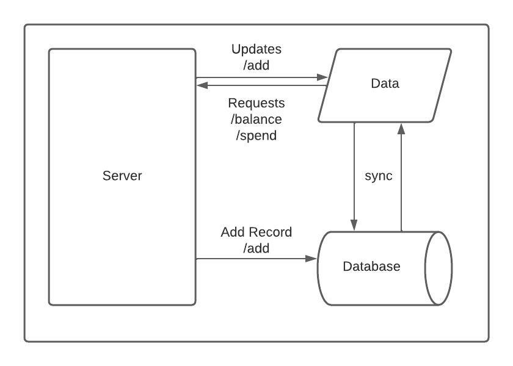

# Fetch Reward Test


## Execution Steps

- To start the server using `npm`, run the following command at root
  
  ```
  $ npm start
  ```
- To start the server using `nodemon`, run the following command at root
  
  ```
  $ nodemon
  ```
- To run tests, run the following command at root.
  ```
  $ npm test
  ```

> For any modifications, modify package.json or nodemon.json files for npm and nodemon respectively.


## Files Structure
```
.
+-- index.js 
+-- main.js
+-- util.js
+-- impl.js
+-- test
|   +-- app.test.js
|   +-- test-constants.js
+-- package.json
+-- nodemon.json
+-- ReadMe.md
```

**Details**
- Entry point is `index.js`
- `util.js` contains implementation of common functions needed for the main functionality.
- `impl.js` is the implementation of main functionality of the end points.
- `test` folder contains the test case related files.
- `package.json`, `nodemon.js` are configuration files needed for `npm` and `nodemon` respectively.


## End points

<details open > 
<summary style='border: 2px solid black;padding:5px;border-radius:10px;'>
    <b>/add</b>
</summary>
<br>

<b>API End point</b>

```
POST http://localhost:9090/add

Request Body Format:
{
    "payer": <payer-name>,
    "points": <points>,
    "timestamp": <timestamp> [sample format: "2021-03-01T14:00:00Z"]
}
```

<b>Returns</b>
- The request returns status code `200` and `{code:200, msg: 'success'}` upon successful add operation.
- Returns status code `400` and `{code:200, msg: <error-msg>}` for failures.

<b>Example</b>
```
Request:
POST http://localhost:9090/add
{
    "payer": "DANNON1",
    "points": -200,
    "timestamp": "2021-03-01T14:00:00Z"
}

Response:
{
  "code": 200,
  "msg": "success"
}
```

</details>
 
<details style="margin-top:5px;">
<summary style='border: 2px solid black;padding:5px;border-radius:10px;'>
    <b>/spend</b>
</summary>
<br>

<b>API End point</b>
```
POST http://localhost:9090/spend

Request Body Format:
{
    "points": <points-to-spend>,
}
```

<b>Returns</b>

- List of all spent payers along with their points.
- If the points are insufficient or not available, then `Spend Fail` property will appear in the response [`Spend Fail: <points>`]

<b>Example</b>
```
Request:
POST http://localhost:9090/spend
{
    "points": 450
}

Response:
{
    "DANNON1": 200,
    "Spend Fail": 250
}
```

</details>
 
<details style="margin-top:5px;" open>
<summary style='border: 2px solid black;padding:5px;border-radius:10px;'>
    <b>/balance</b>
</summary>
<br>

<b>API End point</b>
```
GET http://localhost:9090/balance
```

<b>Returns</b>

- List of all payer remaining points.
- Returns empty list if none of the payers has any points.

<b>Example</b>
```
Request:
GET http://localhost:9090/balance

Response:
{
  "DANNON1": 200
}
```

</details>

## Flow



---
